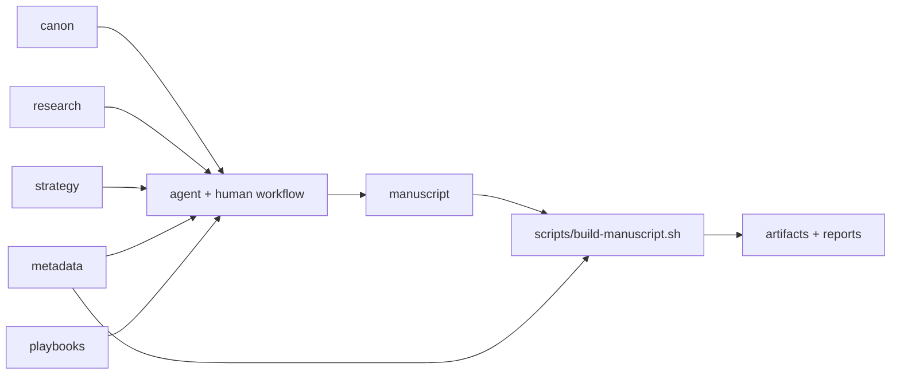

# Narrative-as-Code Starter

An open-source, local-first starter for authors, editors, and narrative teams who want a cleaner way to run a manuscript as a structured system instead of a single fragile document.

This repo demonstrates a practical pattern for chapter-scoped writing, canon grounding, metadata hygiene, review packaging, audiobook prep, and agent collaboration that stays diffable and human-led.

## What You Get Right Now

This starter is not just a folder layout. It already supports:

- chapter-based manuscript source files
- canonical story files for durable truth and controlled ambiguity
- JSON metadata with schema validation
- reproducible manuscript builds
- continuity and drift reporting
- project-level reporting for review and handoff
- audiobook support scaffolding
- operator playbooks for agent and editor workflows
- import support for monolithic Markdown drafts
- bootstrap support for replacing the sample with a new project
- CI-friendly validation and build steps

## Why This Exists

Narrative-as-code is not about treating fiction like software.

It is about borrowing the few software practices that make long-form creative work easier to manage:

- modular source files
- explicit source-of-truth documents
- lightweight metadata
- reproducible outputs
- diffable changes
- chapter-scoped agent workflows grounded in real project context

The goal is not automation for its own sake. The goal is a writing environment where humans stay in charge and support systems stay coherent.

## Who This Is For

This starter is best for:

- authors working on longer or more complex projects
- editorial micro-studios, ghostwriters, and book coaches
- small narrative teams managing canon, revisions, and handoffs
- writer-builders comfortable with Markdown, Git, VS Code, Codex, or similar tools

If you want a single giant word processor file, this repo is probably not the right fit.

## The Core Superpower

The strongest move in this starter is not “AI writes your book.”

It is that chapters, canon, metadata, research, and production support live in separate but connected source files, which makes it much easier to:

- run continuity checks without vague prompts
- revise one chapter without losing project context
- keep metadata aligned with prose
- generate clean review packets and production artifacts
- collaborate with agents without surrendering authorship

## Repo Map

- `manuscript/` contains reader-facing text
- `canon/` holds durable truth, rule boundaries, and unresolved questions
- `metadata/` tracks project state and chapter order
- `research/` stores concise scene-usable packets
- `strategy/` stores revision and workflow planning
- `editor-review/` holds outside-review support material
- `audio/` holds narration and audiobook prep scaffolding
- `playbooks/` provides chapter-scoped operator workflows
- `scripts/` validates, builds, reports, and imports
- `templates/` gives you reusable starting points
- `docs/` contains demo and adoption guidance

## Architecture



## 10-Minute Quick Start

1. Clone the repo.
2. Open it in VS Code or your preferred editor.
3. Review `metadata/project.json` and `metadata/chapters.json`.
4. Read the sample in `manuscript/` and `canon/`.
5. Check local dependencies:

```sh
python3 scripts/check-setup.py
```

6. Validate the sample:

```sh
python3 scripts/validate-project.py
```

7. Build the sample manuscript and reports:

```sh
./scripts/build-manuscript.sh
```

8. Open the generated artifacts in `build/`.
9. Review one playbook in `playbooks/`.
10. Replace the sample project or import your own draft.

Optional dependencies:

```sh
python3 -m pip install -r requirements-dev.txt
python3 -m pip install -r requirements-docx.txt
```

Install `pandoc` locally if you want EPUB output.

For platform-specific install commands, see `docs/dependency-install.md`.

## Key Commands

```sh
python3 scripts/check-setup.py
python3 scripts/validate-project.py
./scripts/build-manuscript.sh
python3 scripts/bootstrap-project.py --title "My Novel" --author "Author Name"
python3 scripts/report-continuity.py
python3 scripts/import-markdown-manuscript.py --input draft.md --output-dir manuscript/chapters --metadata-out metadata/chapters-import.json
python3 -m unittest discover -s tests -v
```

## Outputs And Reports

Running `./scripts/build-manuscript.sh` generates:

- `build/<slug>-draft.md`
- `build/<slug>-draft.epub` when `pandoc` is installed
- `build/<slug>-print-source.docx` when `python-docx` is installed
- `build/manuscript-stats.json`
- `build/continuity-report.json`
- `build/continuity-report.md`
- `build/project-report.json`
- `build/project-report.md`

These reports are useful for:

- chapter-level word counts
- target progress tracking
- POV and status breakdowns
- continuity bridge coverage
- open-question tracking
- review handoff preparation

## Recommended Workflow

1. Draft or revise a chapter in `manuscript/chapters/`.
2. Update canon if the chapter locks durable truth.
3. Add unresolved questions to `canon/open-questions.md`.
4. Update `metadata/chapters.json` if title, POV, status, or summary changed.
5. Use a relevant playbook from `playbooks/`.
6. Run validation.
7. Rebuild outputs and reports.
8. Review `build/continuity-report.md` and `build/project-report.md`.

## Playbooks

The starter now includes operator-ready workflows for:

- chapter review
- chapter refinement
- continuity checks
- metadata updates
- editor packet prep

Start in `playbooks/README.md`.

## Importing An Existing Draft

If your manuscript currently lives in one Markdown file, split it into chapter files with:

```sh
python3 scripts/import-markdown-manuscript.py \
  --input draft.md \
  --output-dir manuscript/chapters \
  --metadata-out metadata/chapters-import.json
```

This utility is intentionally conservative. It gives you structured chapter files and starter metadata so you can finish the migration with judgment instead of hand-copying everything.

## Replacing The Sample With Your Own Project

If you want to turn the sample repo into a fresh working manuscript in place, use:

```sh
python3 scripts/bootstrap-project.py \
  --title "My Novel" \
  --author "Author Name" \
  --subtitle "A Working Draft for Narrative-as-Code"
```

This will reset the sample manuscript, canon, metadata, and support files to a clean starter state while preserving the repo structure, scripts, templates, and tests.

## Adoption Modes

The starter is designed to flex across a few real usage patterns:

- solo novel workflow
- editorial micro-studio workflow
- audio-first production workflow

See `docs/adoption-archetypes.md`.

## What Is Available Today

Available now in this repo:

- local-first source structure
- validation and build scripts
- continuity and project reporting
- sample canon, review, and audio scaffolding
- operator playbooks
- import utility
- CI example

## Demo Path

If you want to show this to collaborators, use `docs/demo-walkthrough.md` for a tight 3-5 minute walkthrough.

If you want launch artwork instead of a screenshot, start with `docs/launch-art-prompt.md`.

## Contributing And Support

- contribution guide: `CONTRIBUTING.md`
- security policy: `SECURITY.md`
- changelog: `CHANGELOG.md`
